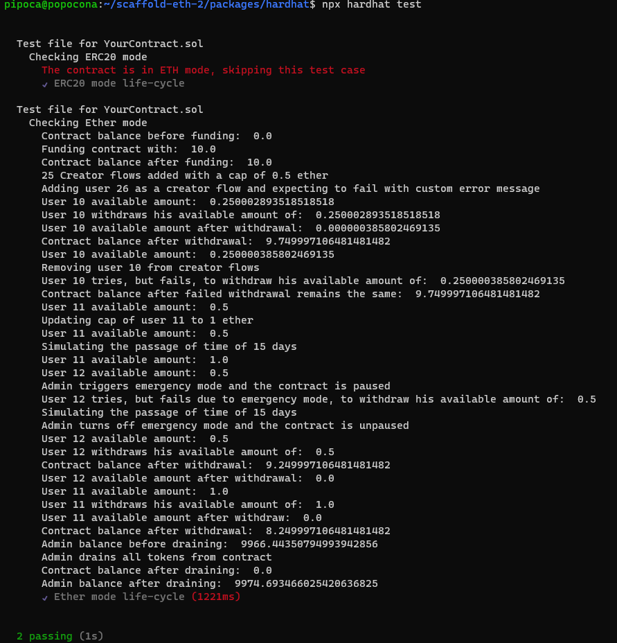
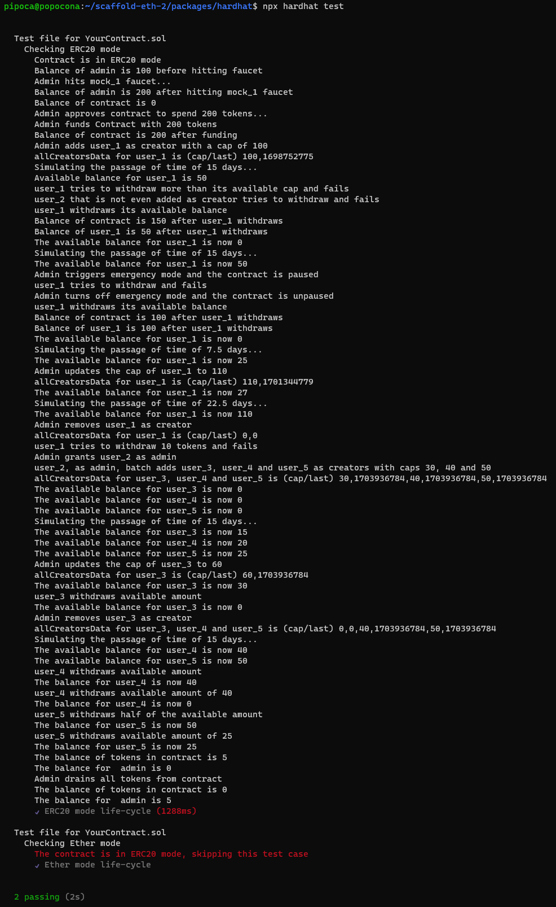

<div align="center">
  
</div>

# Overview - Slim Launchpod (sandbox repo)

This contract is designed to manage payments and funding for a set of 'creators', using either Ethereum's native currency, Ether, or an ERC20 token. The central element of the contract is the notion of a 'creator flow', which is essentially a set of funding rules for each creator, allowing them to withdraw funds from the contract up to a specified limit during a specified cycle.

The constructor function of this smart contract is used to initialize some important variables when the contract is deployed. Here's a breakdown of its purpose and functionality:

```solidity
    constructor(address _primaryAdmin,address _tokenAddress,address[] memory _creators,uint256[] memory _caps) {
        _setupRole(DEFAULT_ADMIN_ROLE, _primaryAdmin);
        primaryAdmin = _primaryAdmin;

        if (_tokenAddress != address(0)) {
            isERC20 = true;
            tokenAddress = _tokenAddress;
        }

        if (_creators.length > 0) {
            addBatch(_creators, _caps);
        }
    }
```
Three key parameters: address _primaryAdmin, address _tokenAddress, and the pair address[] memory _creators, uint256[] memory _caps. These parameters are involved in essential functionalities like assigning administrative rights, defining the type of token the contract interacts with, and setting up the initial creators and their limits within the contract.

1. `address _primaryAdmin` parameter is used to set up the initial administrator of the contract. The `_setupRole(DEFAULT_ADMIN_ROLE, _primaryAdmin)` function call assigns the `DEFAULT_ADMIN_ROLE` to the `_primaryAdmin` address. This role can then perform administrative actions such as adding or removing creators. The `primaryAdmin` address is then stored in a state variable.

2. `address _tokenAddress` parameter is used to define the address of an ERC20 token if the contract is intended to work with tokens other than ETH. If `_tokenAddress` is not equal to zero (which would indicate it's not set), the `isERC20` boolean is set to true and `tokenAddress` state variable is set to the `_tokenAddress` parameter.

3. `address[] memory _creators, uint256[] memory _caps` parameters are arrays that contain the addresses of the initial set of creators and their respective caps (maximum amounts of funds that can be withdrawn in a cycle). The `addBatch(_creators, _caps)` function call is used to batch add creators to the contract if the `_creators` array length is more than zero. This function adds each creator and their respective cap to the contract, assuming that the number of creators does not exceed the maximum allowed and the lengths of `_creators` and `_caps` are equal.

Key functions and their explanations:

1. `fundContract(uint256 _amount)` function:

This function is used to fund the contract with Ether or ERC20 tokens. In the case of Ether, the contract checks that the `msg.value` (the Ether sent with the function call) is not zero, emits a `FundsReceived` event, and adds the value to the contract's balance. If the contract is set up for ERC20 tokens (`isERC20` is true), it instead transfers the `_amount` of tokens from the sender to the contract using `safeTransferFrom()` function provided by the OpenZeppelin `SafeERC20` library, checks the balance to make sure it was transferred correctly, and emits an `ERC20FundsReceived` event.

2. `emergencyMode(bool _enable)` function:

 This function allows an admin to set the contract into emergency mode by changing the `stopped` boolean to true or false. When `stopped` is true, certain actions (like withdrawals) cannot be performed, making this a safety mechanism for the contract.

3. `allCreatorsData(address[] calldata _creators)` function:

 This function allows anyone to view the details of one or multiple creators by providing an array of their addresses. It returns an array of `CreatorFlowInfo` structs, which includes the cap and the timestamp of the last withdrawal for each creator.

4. `addCreatorFlow(address payable _creator, uint256 _cap)` function:

This function allows an admin to add a new creator to the contract. It checks the inputs, assigns a cap to the creator (the maximum amount they can withdraw in a cycle), and adds the creator to the `activeCreators` array.

5. `removeCreatorFlow(address _creator)` function:

 This function allows an admin to remove a creator. It deletes the creator from the `flowingCreators` mapping and `creatorIndex` mapping, and removes them from the `activeCreators` array.

6. `flowWithdraw(uint256 _amount, string memory _reason)` function:

This function allows a creator to withdraw their available funds. It checks the available amount for withdrawal, whether the contract has enough funds, and updates the last withdrawal time. It handles both Ether and ERC20 tokens according to the `isERC20` boolean.

7. `drainAgreement(address _token)` function:

This function allows the admin to transfer all remaining funds in the contract to the `primaryAdmin` address. It can be used to remove remaining Ether or specific ERC20 tokens from the contract. The function checks whether the contract's balance is more than zero before proceeding with the transfer.

## In a nutshell…
This contract is designed to manage payments and funding for a set of 'creators', using either Ethereum's native currency, Ether, or an ERC20 token. The central element of the contract is the notion of a 'creator flow', which is essentially a set of funding rules for each creator, allowing them to withdraw funds from the contract up to a specified limit during a specified cycle.

The 'available amount' within the contract is the amount of money a particular creator is allowed to withdraw during the current cycle. The 'availableCreatorAmount' function is used to calculate this.

Here's how it works:

```solidity
function availableCreatorAmount(
    address _creator
) public view isFlowActive(_creator) returns (uint256) {
    CreatorFlowInfo memory creatorFlow = flowingCreators[_creator];
    uint256 timePassed = block.timestamp - creatorFlow.last;
    uint256 cycleDuration = CYCLE;

    if (timePassed < cycleDuration) {
        uint256 availableAmount = (timePassed * creatorFlow.cap) /
            cycleDuration;
        return availableAmount;
    } else {
        return creatorFlow.cap;
    }
}
```

Each 'creator flow' includes a 'cap' (the maximum amount of funds that can be withdrawn in a cycle) and a 'last' (the timestamp of the last withdrawal). The 'availableCreatorAmount' function first retrieves the creator flow for the given creator address, then calculates how much time has passed since the last withdrawal. If less time has passed than the length of a full cycle, the function calculates the amount the creator can withdraw proportionally. If a full cycle or more has passed, the creator can withdraw the full cap amount.

# Deployment instructions

deployment file: `slimlaunchpod-sandbox/packages/hardhat/deploy/01_deploy_your_contract.ts`

In this contract deployment file, the `args` array represents the arguments that are passed to the contract's constructor during deployment. Here's a breakdown of what each argument represents in this specific case:

```typescript
args: [deployer,ZERO_ADDRESS,[],[]]
```

- `deployer` : This is the address of the account that deploys the contract. This address will be set as the primary admin and granted the `DEFAULT_ADMIN_ROLE` in the AccessControl contract.
- `ZERO_ADDRESS` : This is a placeholder address representing the Ethereum zero address. If this is used as the `_tokenAddress` in the constructor, it means the contract is not in ERC20 mode (but in ETH mode) because the zero address indicates that no ERC20 token address has been provided.
- `[]` : The first empty array is supposed to contain a list of creator addresses.
- `[]` : The second empty array is supposed to contain the corresponding caps for each creator.

Now, if you want to deploy the contract in ERC20 mode, you can pass the address of the ERC20 token as the second argument like so:

```typescript
args: [deployer,ERC20Mock1Address,[],[]]
```

`ERC20Mock1Address` is the address of the ERC20 token that you want the contract to support. With this configuration, any funds sent to the contract must be in this specific ERC20 token. 

If you want to add creators during deployment, you can pass them in the third and fourth arguments like so:

```typescript
args: [deployer,ZERO_ADDRESS,arrayofcreators,caps]
```

Here, `arrayofcreators` is an array of addresses of the creators you want to add, and `caps` is an array of the corresponding cap amounts for each creator.

In conclusion, you can adjust the `args` array to deploy the contract in various configurations. Whether you want it in ETH mode or ERC20 mode, or whether you want to add creators during deployment, depends on the arguments you pass.

# Testing

Once you're in your Hardhat project directory, run the following command to execute your test files:

```
npx hardhat test
```
This command will compile your contracts if necessary and then execute all test files in the test folder.

In your case, there are two test files – one for each mode (ETH or ERC20). The specific test file that runs depends on how the deploy file is set up.

If your args array in the deploy file is set to ETH mode, i.e., the second argument is ZERO_ADDRESS:

```typescript
args: [deployer,ZERO_ADDRESS,[],[]]
```
then Hardhat will execute the test file for ETH mode.



On the other hand, if your args array in the deploy file is set to ERC20 mode, i.e., the second argument is an ERC20 token address:

```typescript
args: [deployer,ERC20Mock1Address,[],[]]
```
then Hardhat will execute the test file for ERC20 mode.


